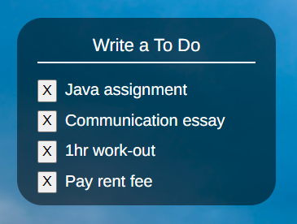
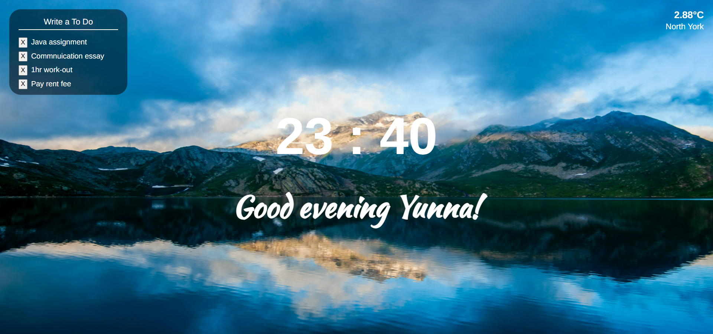

# Momentum

## Overview
Clone project of chrome extension 'momentum'. The weather, time is automatically displayed and the user can save their name and schedules

## Technologies
- HTML5
- CSS3
- JavaScript ES6+
- Weather API

## Features
- **Time display**
  - The time is automatically displayed and it is updated every minute

- **Weather display**
  - If the user agrees to give permission to get geolocation info, the weather info will be displayed based on the user's geolocation

- **Greetings**
  - If the user enter their name, a proper greeting that matches with time will be displayed.
  - User name info is stored in local storage so it doesn't go away  even after reloading the page

- **Background change**
  - The background is changed randomly on every reload

- **To-do list**
  - The user can create/delete schedule
  - To do item is stored in local storage so it doesn't go away  even after reloading the page

## Screenshot

